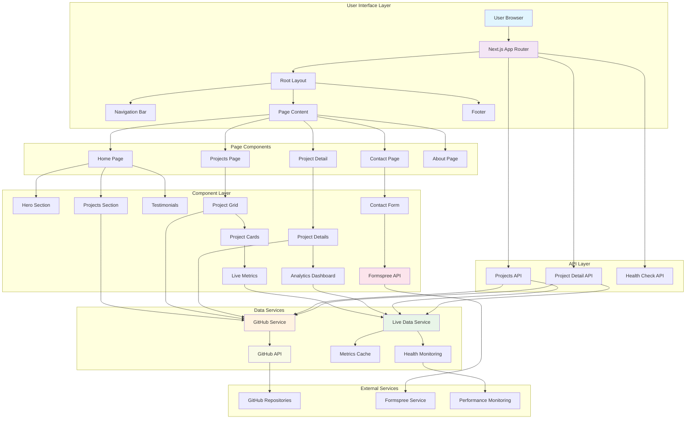

# Nitish Singh - Portfolio Website

A comprehensive, modern portfolio website built with Next.js 15, TypeScript, and Tailwind CSS. Features real-time project metrics, interactive components, and seamless user experience with advanced animations and responsive design.

## 🚀 Features

### Core Features
- **Modern Design**: Clean, professional design with smooth Framer Motion animations
- **Real-time Data**: Live project metrics and GitHub integration
- **Responsive Design**: Fully responsive across all devices and screen sizes
- **Performance Optimized**: Built with Next.js 15 App Router for optimal performance
- **Type-Safe**: Full TypeScript implementation with comprehensive type definitions
- **SEO Optimized**: Built-in SEO features, meta tags, and sitemap generation
- **Interactive Components**: Live metrics dashboard, image sliders, and testimonials

### Advanced Features
- **GitHub Integration**: Automatic project fetching from GitHub API
- **Live Metrics Dashboard**: Real-time project health monitoring
- **Contact Form**: Integrated Formspree contact form with validation
- **Dynamic Routing**: Server-side rendered project detail pages
- **Image Optimization**: Next.js automatic image optimization with fallbacks
- **Professional Icons**: Custom favicon and touch icons

## 🛠️ Tech Stack

### Frontend Technologies
- **Framework**: Next.js 15 (App Router)
- **Language**: TypeScript 5.x
- **Styling**: Tailwind CSS 4.x
- **Animations**: Framer Motion 12.x
- **Icons**: Lucide React, React Icons
- **Forms**: Formspree React Integration

### Development Tools
- **Linting**: ESLint with Next.js configuration
- **Code Quality**: TypeScript strict mode
- **Build System**: Next.js built-in build system
- **Package Manager**: npm

### External APIs
- **GitHub API**: Project data fetching via Octokit
- **Formspree**: Contact form handling

## 📁 Comprehensive Project Structure

```
NitishSingh/
├── 📁 public/                           # Static assets and resources
│   ├── 📁 images/                       # All image assets
│   │   ├── default-avatar.jpg           # Default user avatar
│   │   ├── 📁 fallback/                 # Fallback project images
│   │   │   ├── project-1.jpg
│   │   │   ├── project-2.jpg
│   │   │   ├── project-3.jpg
│   │   │   ├── project-4.jpg
│   │   │   └── project-5.jpg
│   │   ├── 📁 projects/                 # Project-specific images
│   │   │   ├── tableCraft.jpg
│   │   │   └── project-placeholder.jpg
│   │   ├── 📁 slider/                   # Hero section slider images
│   │   │   ├── slide1.jpg
│   │   │   ├── slide2.jpg
│   │   │   ├── slide3.jpg
│   │   │   └── slide4.jpg
│   │   └── 📁 testimonials/             # Testimonial profile images
│   │       ├── Aditi Sharma.jpg
│   │       ├── Krishna.jpg
│   │       ├── Pankaj Kumar.jpg
│   │       └── Saraswat Mukherjee.jpg
│   ├── favicon.ico                      # Standard favicon
│   ├── nitish-favicon.svg               # Custom SVG favicon
│   ├── robots.txt                       # SEO robots file
│   └── vercel.svg                       # Vercel logo
├── 📁 src/                              # Source code directory
│   ├── 📁 app/                          # Next.js 15 App Router
│   │   ├── 📁 about/                    # About page route
│   │   │   └── page.tsx                 # About page component
│   │   ├── 📁 api/                      # API routes
│   │   │   └── 📁 projects/             # Projects API endpoints
│   │   │       ├── 📁 [name]/           # Dynamic project API route
│   │   │       │   └── route.ts         # Individual project API
│   │   │       └── route.ts             # Projects listing API
│   │   ├── 📁 contact/                  # Contact page route
│   │   │   └── page.tsx                 # Contact page with form
│   │   ├── 📁 projects/                 # Projects section
│   │   │   ├── 📁 [name]/               # Dynamic project detail pages
│   │   │   │   └── page.tsx             # Individual project page
│   │   │   └── page.tsx                 # Projects listing page
│   │   ├── apple-icon.tsx               # Apple touch icon generator
│   │   ├── favicon.ico                  # Favicon file
│   │   ├── globals.css                  # Global CSS styles and variables
│   │   ├── icon.tsx                     # Dynamic favicon component
│   │   ├── layout.tsx                   # Root layout with metadata
│   │   └── page.tsx                     # Home page component
│   ├── 📁 components/                   # Reusable React components
│   │   ├── ContactForm.tsx              # Formspree contact form
│   │   ├── Footer.tsx                   # Site footer with social links
│   │   ├── Hero.tsx                     # Hero section with animations
│   │   ├── ImageSlider.tsx              # Image carousel component
│   │   ├── LiveMetricsDashboard.tsx     # Real-time metrics display
│   │   ├── Navbar.tsx                   # Responsive navigation bar
│   │   ├── ProjectCard.tsx              # Project display card
│   │   ├── ProjectsSection.tsx          # Projects grid section
│   │   └── Testimonials.tsx             # Testimonials carousel
│   ├── 📁 lib/                          # Utility libraries and services
│   │   ├── github.ts                    # GitHub API integration
│   │   └── liveData.ts                  # Live data service management
│   └── 📁 types/                        # TypeScript type definitions
│       └── index.ts                     # Comprehensive type definitions
├── 📁 Configuration Files
├── .eslintrc.json                       # ESLint configuration
├── eslint.config.mjs                    # ESLint ES modules config
├── next.config.js                       # Next.js configuration
├── next-env.d.ts                        # Next.js TypeScript declarations
├── package.json                         # Dependencies and scripts
├── package-lock.json                    # Dependency lock file
├── postcss.config.mjs                   # PostCSS configuration
├── tailwind.config.js                   # Tailwind CSS configuration
├── tsconfig.json                        # TypeScript configuration
└── vercel.json                          # Vercel deployment settings
```

## 🏗️ Detailed Module Architecture & Component Breakdown

### 📁 Core Application Modules

#### 🎯 **App Router Module** (`src/app/`)
Complete Next.js 15 App Router implementation with advanced features:

##### 📄 **Page Components**
- **Root Layout** (`layout.tsx`): Application shell with Navbar, Footer, and global providers
- **Home Page** (`page.tsx`): Landing page with Hero, ProjectsSection, and Testimonials
- **Projects Hub** (`projects/page.tsx`): Complete project listing with GitHub API integration
- **Project Detail** (`projects/[name]/page.tsx`): Dynamic project pages with SSR
- **Contact Portal** (`contact/page.tsx`): Professional contact form with Formspree
- **About Profile** (`about/page.tsx`): Personal and professional showcase
- **Health Check** (`api/health/route.ts`): System health monitoring endpoint

##### 🔌 **API Infrastructure**
- **Projects API** (`api/projects/route.ts`): GitHub data aggregation with live metrics
- **Individual Project API** (`api/projects/[name]/route.ts`): Detailed project analytics
- **Dynamic Icons** (`icon.tsx`, `apple-icon.tsx`): Programmatic favicon generation

#### 🧩 **Components Module** (`src/components/`)
Reusable, feature-rich React components with TypeScript:

##### 🎨 **UI Components**
- **Navbar** (`Navbar.tsx`): Responsive navigation with mobile hamburger menu
- **Hero** (`Hero.tsx`): Animated hero section with image slider
- **Footer** (`Footer.tsx`): Professional footer with social links and branding

##### 📊 **Data Display Components**
- **ProjectsSection** (`ProjectsSection.tsx`): Grid layout with GitHub API integration
- **ProjectCard** (`ProjectCard.tsx`): Interactive project cards with hover effects
- **LiveMetricsDashboard** (`LiveMetricsDashboard.tsx`): Real-time performance monitoring
- **Testimonials** (`Testimonials.tsx`): Customer testimonials carousel

##### 🎭 **Interactive Components**
- **ImageSlider** (`ImageSlider.tsx`): Smooth image carousel with transitions
- **ContactForm** (`ContactForm.tsx`): Validated contact form with Formspree integration

#### 🔧 **Services Module** (`src/lib/`)
Business logic and external API integrations:

##### 🐙 **GitHub Integration** (`github.ts`)
- **API Functions**: `getGithubProjects()`, `getGithubUser()`
- **Image Management**: `imageExists()`, `getRandomFallbackImage()`
- **Data Enhancement**: Repository data enrichment with live metrics
- **Caching Strategy**: Response caching for performance optimization

##### 📈 **Live Data Service** (`liveData.ts`)
- **Real-time Metrics**: Performance monitoring and health checks
- **Cache Management**: Intelligent caching with 5-minute TTL
- **Error Handling**: Fallback to cached data on API failures
- **Service Classes**: Singleton pattern for data consistency

#### 🏷️ **Types Module** (`src/types/index.ts`)
Comprehensive TypeScript definitions:

##### 📋 **Core Interfaces**
- **Project**: Enhanced GitHub repository with live metrics
- **LiveMetrics**: Real-time performance data structure
- **ProjectHealth**: Comprehensive health monitoring
- **DeploymentInfo**: Deployment status and information
- **GithubUser**: GitHub user profile data
- **Testimonial**: Customer testimonial structure
- **Review**: Project review system

### 🎨 **Asset Management** (`public/`)
Organized static asset structure:

#### 🖼️ **Image Assets**
- **Project Images**: `/images/projects/` - Specific project screenshots
- **Fallback Images**: `/images/fallback/` - Default project placeholders
- **Testimonials**: `/images/testimonials/` - Customer profile photos
- **Hero Slider**: `/images/slider/` - Homepage carousel images
- **Branding**: Custom favicon and icons

#### 📄 **Static Files**
- **SEO**: `robots.txt` for search engine optimization
- **Icons**: Multiple favicon formats and sizes
- **Config**: Vercel deployment configuration

### ⚙️ **Configuration Module**
Development and build configuration:

#### 🔧 **Build Tools**
- **Next.js Config** (`next.config.js`): Framework configuration
- **TypeScript** (`tsconfig.json`): Strict type checking
- **ESLint** (`eslint.config.mjs`): Code quality enforcement
- **PostCSS** (`postcss.config.mjs`): CSS processing
- **Tailwind** (`tailwind.config.js`): Utility-first styling

#### 📦 **Dependencies**
- **Core**: Next.js 15, React 19, TypeScript 5
- **Styling**: Tailwind CSS 4, Framer Motion 12
- **Integration**: Octokit (GitHub), Formspree (Forms)
- **Icons**: Lucide React, React Icons

## 🔄 Comprehensive Application Workflow Chart

### 🌊 **Data Flow Architecture**



### 🔀 **Request Processing Flow**

#### 1. **Homepage Request Flow**
```
User Request → Next.js Router → Layout Component → Home Page
    ↓
Hero Component + Projects Section + Testimonials
    ↓
GitHub Service → GitHub API → Project Data
    ↓
Live Data Service → Cached Metrics → Real-time Display
    ↓
Rendered Homepage with Live Data
```

#### 2. **Projects Listing Flow**
```
Projects Route → Projects Page Component
    ↓
Projects API Endpoint (/api/projects)
    ↓
GitHub Service → Repository Fetching
    ↓
Live Data Service → Metrics Enhancement
    ↓
Project Cards with Live Status
    ↓
Interactive Grid Display
```

#### 3. **Individual Project Flow**
```
Project Detail Route (/projects/[name])
    ↓
Dynamic API Route (/api/projects/[name])
    ↓
GitHub Service → Specific Repository Data
    ↓
Live Data Service → Enhanced Analytics
    ↓
Project Detail Page with Full Analytics
```

#### 4. **Contact Form Flow**
```
Contact Form Component → Form Validation
    ↓
Formspree Integration → External API
    ↓
Success/Error State → User Feedback
    ↓
Email Notification → Form Submission Complete
```

### 🔧 **System Architecture Components**

#### **Frontend Architecture**
- **Framework**: Next.js 15 with App Router
- **Styling**: Tailwind CSS 4 with custom design system
- **Animations**: Framer Motion for smooth transitions
- **State Management**: React hooks and context
- **Type Safety**: TypeScript with strict mode

#### **Backend Architecture**
- **API Routes**: Next.js API routes for server-side logic
- **Data Fetching**: Server-side rendering and client-side hydration
- **Caching**: Intelligent caching with TTL for performance
- **Error Handling**: Graceful degradation and fallbacks

#### **External Integrations**
- **GitHub API**: Repository data via Octokit
- **Formspree**: Contact form submissions
- **Performance Monitoring**: Real-time metrics simulation
- **Image Optimization**: Next.js automatic image optimization

### 📊 **Data Processing Pipeline**

```
Raw GitHub Data → Data Enhancement → Cache Storage → Component Rendering
    ↓              ↓                 ↓              ↓
Repository Info    Live Metrics      5min TTL       Interactive UI
Language Stats     Health Status     Error Fallback User Experience
Commit History     Performance       Auto Refresh   Real-time Updates
```

### 🚀 **Deployment & Performance Flow**

#### **Build Process**
```
Source Code → TypeScript Compilation → Next.js Build
    ↓             ↓                     ↓
Type Checking     Bundle Optimization   Static Generation
ESLint Check      Code Splitting        Image Optimization
                  CSS Processing        SEO Enhancement
    ↓
Production Build → Vercel Deployment → Live Application
```

#### **Runtime Performance**
```
User Request → CDN Cache Check → Edge Function
    ↓             ↓               ↓
DNS Resolution    Cache Hit       Server Processing
SSL Certificate   Fast Response   Data Fetching
    ↓                             ↓
Content Delivery ← Optimized Response ← Enhanced Data
```

This workflow ensures optimal performance, maintainability, and user experience through a well-structured architecture with clear separation of concerns and efficient data flow.

## 🎨 UI/UX Design System

### Color Scheme
- **Primary**: Blue gradient (`from-blue-500 to-blue-600`)
- **Secondary**: Purple gradient (`from-purple-500 to-purple-600`)
- **Accent**: Pink highlights (`from-pink-400 to-pink-600`)
- **Background**: Dark theme (`gray-900, gray-800`)
- **Text**: High contrast white/gray system

### Animation System
- **Framework**: Framer Motion
- **Transitions**: Smooth page transitions
- **Hover Effects**: Interactive element feedback
- **Loading States**: Skeleton loaders and spinners
- **Micro-interactions**: Button presses, form interactions

### Responsive Breakpoints
- **Mobile**: `< 768px` - Stack layout, mobile nav
- **Tablet**: `768px - 1024px` - Adjusted grid layouts
- **Desktop**: `> 1024px` - Full grid systems
- **Large**: `> 1440px` - Max-width containers

## 📊 Data Flow Architecture

### 1. Static Data Flow
```
Components → Static Content → Rendered Pages
```

### 2. GitHub API Data Flow
```
GitHub API → lib/github.ts → API Routes → Components → UI
```

### 3. Live Metrics Data Flow
```
Service Timer → lib/liveData.ts → Components → Real-time UI Updates
```

### 4. Contact Form Data Flow
```
User Input → ContactForm → Formspree API → Success/Error States
```

## 🚀 Getting Started

### Prerequisites
```bash
Node.js 18+ (LTS recommended)
npm or yarn package manager
Git for version control
```

### Installation Steps

1. **Clone the repository**
   ```bash
   git clone https://github.com/thenitishmind/NitishSingh.git
   cd NitishSingh
   ```

2. **Install dependencies**
   ```bash
   npm install
   ```

3. **Environment setup**
   Create `.env.local` file:
   ```env
   # GitHub API (Optional - for higher rate limits)
   GITHUB_TOKEN=your_github_personal_access_token
   
   # Formspree (Required for contact form)
   NEXT_PUBLIC_FORMSPREE_ID=your_formspree_form_id
   ```

4. **Development server**
   ```bash
   npm run dev
   ```
   Navigate to `http://localhost:3000`

5. **Production build**
   ```bash
   npm run build
   npm run start
   ```

### Available Scripts

```json
{
  "dev": "next dev",                    // Development server
  "build": "next build",                // Production build
  "start": "next start",                // Production server
  "lint": "next lint",                  // Code linting
  "build:production": "NODE_ENV=production MINIMIZE=true next build"
}
```

## ⚙️ Configuration

### 1. Contact Form Setup (Formspree)
```typescript
// In ContactForm.tsx, update the form ID:
const [state, handleSubmit] = useForm("your_formspree_id");
```

### 2. GitHub Integration
```typescript
// In lib/github.ts, update username:
username: "your_github_username"
```

### 3. Personal Information
Update content in respective components:
- Hero section text
- About page content
- Contact information
- Social media links

### 4. Styling Customization
```javascript
// tailwind.config.js - Customize colors, fonts, spacing
module.exports = {
  theme: {
    extend: {
      colors: {
        // Add custom colors
      }
    }
  }
}
```

## 🚀 Deployment Options

### Vercel (Recommended)
1. Connect GitHub repository to Vercel
2. Configure environment variables
3. Deploy automatically on push
4. Custom domain setup available

### Alternative Platforms
- **Netlify**: Static export with `next export`
- **Railway**: Direct GitHub integration
- **AWS Amplify**: Full-stack deployment
- **Docker**: Containerized deployment

### Environment Variables (Production)
```env
GITHUB_TOKEN=production_github_token
NEXT_PUBLIC_FORMSPREE_ID=production_formspree_id
```

## 📈 Performance Optimizations

### Built-in Optimizations
- **Image Optimization**: Next.js automatic image optimization
- **Code Splitting**: Automatic route-based splitting
- **Static Generation**: Pre-rendered pages where possible
- **Font Optimization**: Automatic font loading optimization

### Custom Optimizations
- **Lazy Loading**: Components and images load on demand
- **Caching**: API response caching with appropriate headers
- **Bundle Analysis**: Optimized imports and tree shaking
- **SEO**: Comprehensive meta tags and structured data

## 🔧 Maintenance & Updates

### Regular Maintenance
- **Dependencies**: Monthly dependency updates
- **Security**: Regular security audit with `npm audit`
- **Performance**: Lighthouse score monitoring
- **Content**: Regular content updates and additions

### Version Control
- **Branching**: Feature branches for new developments
- **Commits**: Conventional commit messages
- **Releases**: Semantic versioning for major updates

## 🤝 Contributing

### Development Workflow
1. Fork the repository
2. Create feature branch (`git checkout -b feature/amazing-feature`)
3. Make changes with proper TypeScript typing
4. Test thoroughly across devices
5. Commit with descriptive messages
6. Push and create Pull Request

### Code Standards
- **TypeScript**: Strict mode enabled
- **Linting**: ESLint with Next.js configuration
- **Formatting**: Consistent code formatting
- **Testing**: Component testing recommended

## 📄 License

This project is licensed under the ISC License - see the [LICENSE.md](LICENSE.md) file for details.

## 👨‍💻 Developer

**Developed and Designed by Nitish Singh**

- **GitHub**: [@thenitishmind](https://github.com/thenitishmind)
- **Portfolio**: [Live Portfolio](https://nitishsingh.dev)

### Professional Skills Showcased
- **Frontend Development**: React, Next.js, TypeScript
- **UI/UX Design**: Responsive design, animations, user experience
- **API Integration**: RESTful APIs, external service integration
- **Performance Optimization**: Core Web Vitals, loading optimization
- **SEO & Accessibility**: Search engine optimization, WCAG compliance

---

⭐ **Star this repository if you found it helpful!**

---

## 📞 Support & Contact

For questions, suggestions, or collaboration opportunities:

- **Issues**: [GitHub Issues](https://github.com/thenitishmind/NitishSingh/issues)
- **Discussions**: [GitHub Discussions](https://github.com/thenitishmind/NitishSingh/discussions)
- **Email**: devops@nitishsingh.dev

---

**🎨 Designed and Created by Nitish Singh**

*Last Updated: January 2025*
